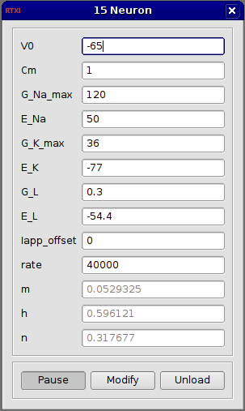

###Neuron (Hodgkin-Huxley)

**Requirements:** None  
**Limitations:** None  

This module is already included in RTXI by default as the “neuron” module but is provided here as a template for creating your own models. This is the classic Hodgkin-Huxley model neuron.

Note that in RTXI 2.0 and subsequent releases, this module is separated from the default RTXI install. Users can add it if needed. 
