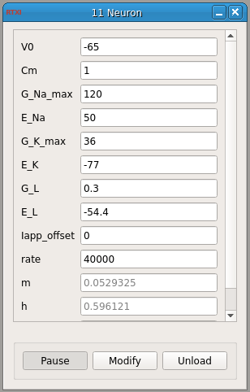

###Neuron (Hodgkin-Huxley)

**Requirements:** None  
**Limitations:** None  

<!--start-->

This is the classic Hodgkin-Huxley model neuron. To find information on the model, find some neuroscience book and open it or just use the internet. Here's the [wikipedia entry](https://en.wikipedia.org/wiki/Hodgkin%E2%80%93Huxley_model). 

<!--end-->

####Input Channels
1. input(0) - Iapp : applied current  (A)

####Output Channels
1. output(0) - Vm : membrane voltage (V)

####Parameters
1. V0 - voltage (mV)
2. Cm - membrane capacitance (uF/cm^2)
3. G_Na_max - max. Na+ conductance density (mS/cm^2)
4. E_Na - Na+ reversal potential (mV)
5. G_K_max - max. K+ conductance density (mS/cm^2)
6. E_K - K+ reversal potential (mV)
7. G_L - leak channel conductance density (mS/cm^2)
8. E_L - leak channel reversal potential (mV)
9. Iapp_offset - offset current added to input (uA/cm^2)
10. rate - rate of integration (Hz)

####States
1. m - sodium activation
2. h - sodium inactivation
3. n - potassium inactivation
